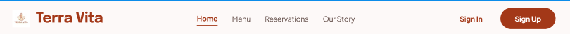
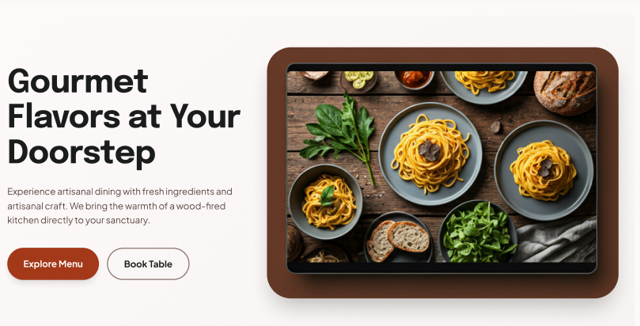
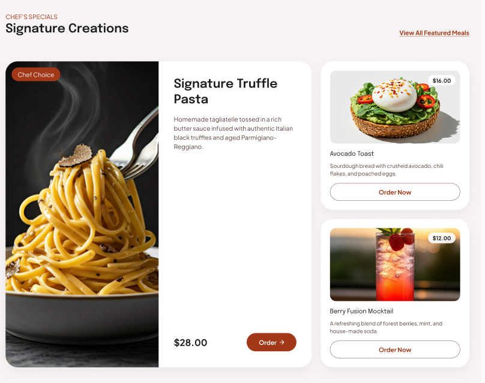
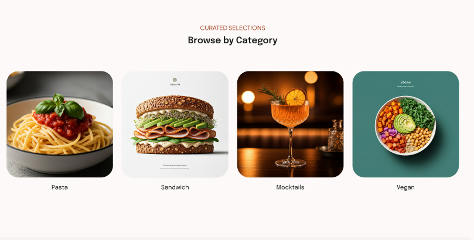
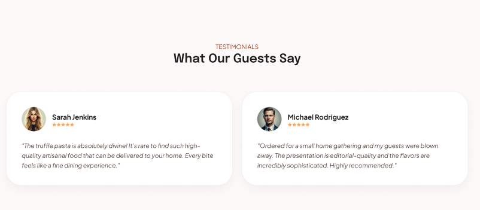
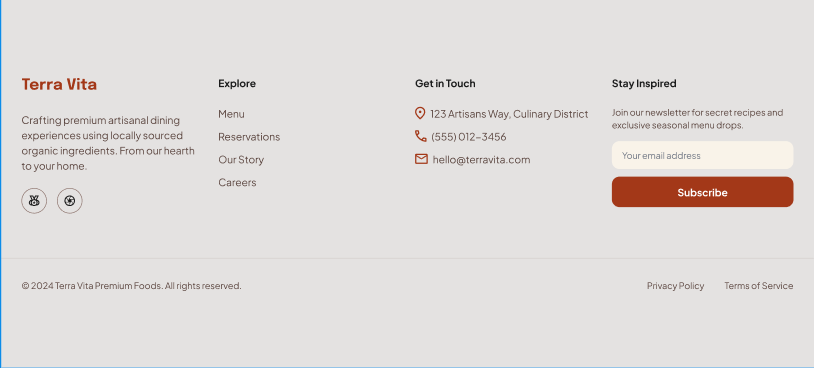

# 🍽️ WELCOME TO ASSIGNMENT-001
#  TERRA VITA — Premium Artisanal Dining

## **📅 Deadline For 60 marks**: (Set your deadline here) ( 11:59 pm ⏱️)
## **📅 Deadline For 50 marks**: (Set your deadline here) ( 11:59 pm ⏱️)
## **📅 Deadline For 30 marks**: Any time after the final deadline.

---

## Requirements (50)

### 1. Navbar Section

- A clean and professional navigation bar with:
  - **Logo**: Placed on the left with an icon and brand name **Terra Vita**.
  - **Navigation Links**: Centered links — Home, Menu, Reservations, Our Story — with an active underline indicator on the current page.
  - **Auth Buttons**: **Sign In** (text) and **Sign Up** (filled dark-red button) placed on the right.
  - **Alignment**: Proper spacing and alignment across all elements as per the design.

---

### 2. Banner / Hero Section

- A visually striking hero section with:
  - **Background Color**: Soft off-white/cream background to create an elegant feel.
  - **Heading and Text**: Positioned on the left — large bold heading *"Gourmet Flavors at Your Doorstep"* with a supporting subtitle below.
  - **Buttons**: Two CTA buttons — **Explore Menu** (filled dark-red) and **Book Table** (outlined).
  - **Image**: A rounded tablet-style frame on the right displaying a food photograph.
  - **Alignment**: Use flexbox with proper margin and padding to match the Figma layout.

---

### 3. Chef's Specials / Signature Creations Section

- A featured section showcasing menu highlights with:
  - **Section Label**: Small uppercase label *"CHEF'S SPECIALS"* and a bold heading *"Signature Creations"*.
  - **View All Link**: Right-aligned *"View All Featured Meals"* link in dark-red.
  - **Featured Card (Left)**: Large card with a food image, a *"Chef Choice"* badge, item name, description, price, and an **Order →** button.
  - **Side Cards (Right)**: Two stacked smaller cards each showing an image, price badge, item name, short description, and an **Order Now** button.
  - **Alignment**: Two-column layout using flexbox or grid.

---

### 4. Browse by Category Section

- A section for filtering menu items by food type:
  - **Section Label**: Small uppercase label *"CURATED SELECTIONS"* above the heading.
  - **Heading**: *"Browse by Category"* centered on the page.
  - **Four Category Cards in a Row**: Each card contains a food/drink image and a label below — **Pasta**, **Sandwich**, **Mocktails**, **Vegan**.
  - **Card Style**: Rounded corners with consistent sizing and subtle background.
  - **Alignment**: Even horizontal spacing using flexbox or grid.

---

### 5. Testimonials Section

- A section to build trust with guest reviews:
  - **Section Label**: Small uppercase label *"TESTIMONIALS"* above the heading.
  - **Heading**: *"What Our Guests Say"* centered on the page.
  - **Two Review Cards Side by Side**: Each card contains:
    - A circular guest avatar image.
    - Guest **Name** and **Star Rating** (5 stars).
    - A quoted review paragraph in italic or styled text.
  - **Card Style**: White card with light shadow on a soft pink/cream background.

---

### 6. Footer Section

- A fully structured footer with four columns:
  - **Column 1 — Brand**: Logo name *"Terra Vita"*, a short brand description, and two circular social icon buttons.
  - **Column 2 — Explore**: Navigation links — Menu, Reservations, Our Story, Careers.
  - **Column 3 — Get in Touch**: Address, phone number, and email with matching icons.
  - **Column 4 — Stay Inspired**: A short newsletter pitch, an email input field, and a **Subscribe** button (dark-red, full-width).
  - **Bottom Bar**: A thin divider line, copyright text on the left, and Privacy Policy / Terms of Service links on the right.
  - **Background Color**: Light grey to visually separate it from the main content.

---

# CHALLENGES (10)

### 7. Hover Effects on Page

- Interactive hover effects throughout the site:
  - **Category Cards**: Scale up slightly or show a colored overlay on hover.
  - **Order / CTA Buttons**: Background color transition on hover with a smooth animation.
  - **Footer Links**: Color change on hover.
  - **Nav Links**: Smooth underline animation on hover.

---

### 8. Active Navigation Indicator

- The current active page link in the navbar should have a visible **underline** or **color highlight**.
- Use CSS to implement this cleanly without JavaScript.

---

### 9. Responsive Navbar (Bonus)

- The navbar should maintain proper alignment across different screen widths.
- Ensure logo and buttons don't overflow or break at medium widths.

---

## 5 Commits and No Lorem Ipsum

- A minimum of **five commits** must be made to show incremental progress.
- **No placeholder text** (e.g., Lorem Ipsum). All content must be meaningful and relevant to the Terra Vita brand.

---

# Technology

- **HTML & CSS only**
- You cannot use any other technology or framework (no Bootstrap, Tailwind, or JavaScript frameworks).

---

# What to Submit

- Your **GitHub Repository** — e.g., `https://github.com/yourusername/terra-vita-assignment`
- Your **Live Link** — e.g., `https://yourusername.github.io/terra-vita-assignment`

---

> 💡 **Tip**: Start with the Navbar and Banner sections first. Build from top to bottom and commit after completing each section.
